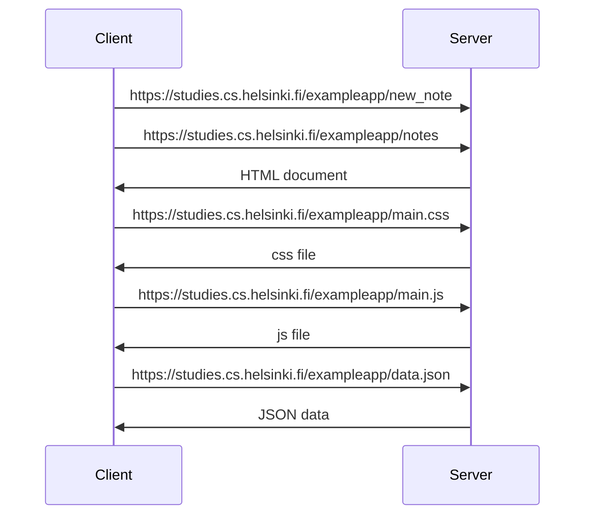

```mermaid
sequenceDiagram;
Client->>Server: https://studies.cs.helsinki.fi/exampleapp/new_note
Client->>Server: https://studies.cs.helsinki.fi/exampleapp/notes
Server->>Client: HTML document
Client->>Server: https://studies.cs.helsinki.fi/exampleapp/main.css
Server->>Client: css file
Client->>Server: https://studies.cs.helsinki.fi/exampleapp/main.js
Server->>Client: js file
Client->>Server: https://studies.cs.helsinki.fi/exampleapp/data.json
Server->>Client: JSON data
```
